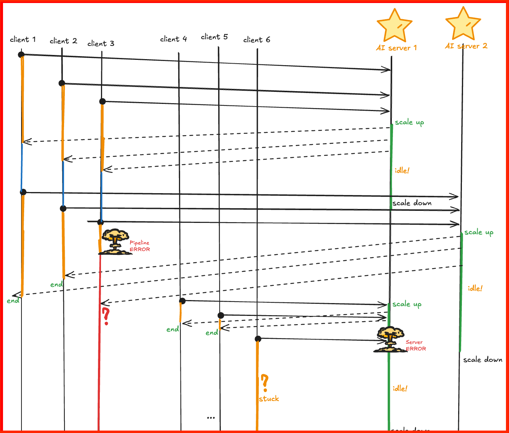
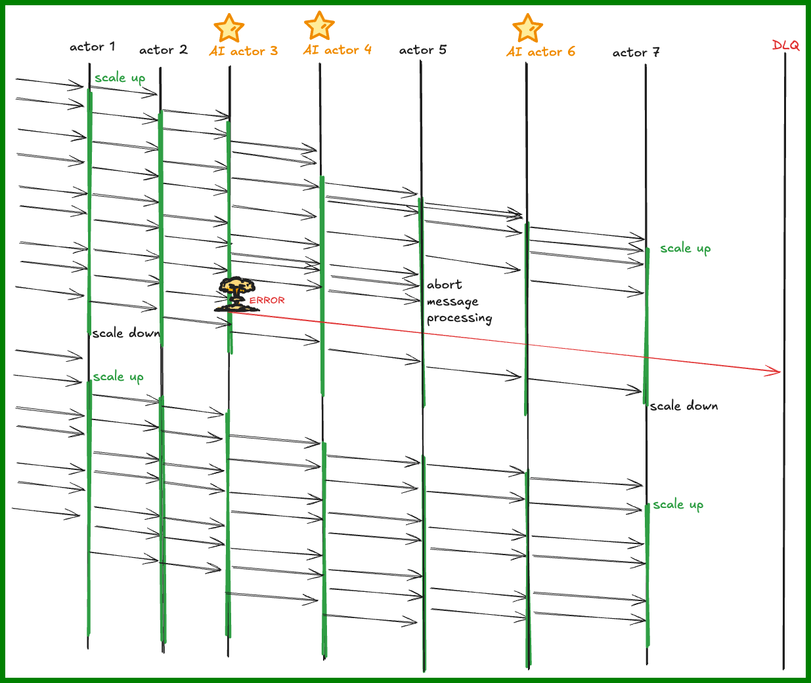
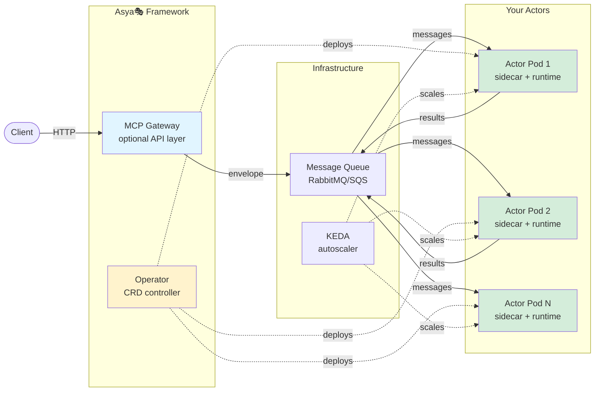

# Asya🎭
> `/ˈɑːsjə/`, from **asy**nc **a**ctors

Kubernetes-native • Distributed • Event-Driven • **AI Orchestration Framework** • That actually scales.

**Key idea**: to fully decouple AI/ML/business logic from infrastructure pipelines to enable scalability.

* async actors
* simple message-passing `A → B → C` instead of request-response `A → B → A → C → A...`
* auto-scale from 0 to ∞ based on work
* stateless by design
* no central orchestrator/pipeline/DAG/flow - message knows the route
* zero pip dependencies (infra completely decoupled from your code)

<p align="left">
📘 <a href="docs/">Docs</a> • 🏗️ <a href="docs/architecture/">Architecture</a> • 🔧 <a href="examples/">Examples</a> • 💻 <a href="src/">Source</a> • ⚙️ <a href="deploy/helm-charts/">Charts</a> • 🧪 <a href="testing/">Testing</a>
<br/><br/>

</p>

Battle-tested at [Delivery Hero](https://tech.deliveryhero.com/) for global-scale AI-powered image enhancement. Now powering LLM and agentic workflows.

## For DS teams:

No more mixing pipeline with real logic, no DAGs or pipelines with custom decorators `@step` or `@pipeline`, even no pip packages - only pure python functions!

Write only a pure python function:
```python
# classifier.py
def process(payload: dict) -> dict:         # input - a dict
    if payload.get("ping"):
        return {"pong": "ok"}               # output - another dict
    raise ValueError("No ping received!")   # or an error
```

**Key idea**: Your handler function *mutates* the payload and returns it — not a request/response pattern. The mutated payload flows to the next actor in the pipeline. Think data transformation pipeline, not API endpoint.


More AI-friendly - a class handlers:
```py
class MyActor:
    def __init__(self, config: str = "/default/path"):
        self.model = load_model(config)  # init once

    def process(self, payload: dict) -> dict:
        return {
            **payload,
            "response": self.model.generate(payload["prompt"]),
        }
```

Your pipelines are **data, not code**, they are a part of messsages passing between actors, not of a third-party orchestrator.

Routes are dynamic, if needed, they can be modified at runtime (for example, for smart routing by LLM agents) - with env var `ASYA_HANDLER_MODE=envelope`:
```py
class MyActor:
    def __init__(self, config: str = "/default/path"):
        self.model = load_model(config)  # init once

    def process_with_modifying_route(self, envelope: dict) -> dict:
        # Envelope is a message passed between actors with structure:
        # {
        #  "payload": {...},    # <- your data object
        #  "route": {           # a route in your "DAG"
        #     "actors": ["data-loader","llm-agent",...],  # list of actors to hit
        #     "current": 0       # zero-based pointer to actor
        #   }
        # }

        # 1. do inference, mutate payload:
        payload = envelope["payload"]
        payload["llm-judge-output"] = model.generate(payload["prompt"])

        # 2. update route by adding extra step and incrementing pointer:
        route = envelope["route"]
        route["actors"] += ["extra-step-at-the-end"]  # add more steps
        route["current"] += 1  # increment current to send it further

        # 3. return mutated envelope:
        return envelope
```

<!-- You can always call it as a pure function for testing - no additional code required:
```python
>>> envelope = {"payload": {"prompt": "text"}, "route": {"actors": ["data-loader"], "current": 0}}
>>> process_with_modifying_route(envelope)
{'payload': {'prompt': 'text', 'llm-judge-output': 'generated'},
 'route': {'actors': ['data-loader', 'extra-step-at-the-end'], 'current': 1}}
``` -->

# For Platform teams:
Deploy user code via CRDs:
```yaml
apiVersion: asya.sh/v1alpha1
kind: AsyncActor
metadata:
  name: image-classifier
spec:
  transport: sqs
  scaling:  # via KEDA
    minReplicas: 0
    maxReplicas: 100
    queueLength: 5
  workload:
    type: Deployment
    template:
      spec:
        containers:
        #- name: asya-sidecar # <- auto-injected container for routing logic
        - name: asya-runtime  # <- container running user code
          image: my-classifier:latest
          env:
          - name: ASYA_HANDLER
            value: "my_classifier.MyActor.process"
```

**Under the hood:** Kubernetes Operator manages `AsyncActor` CRD, sidecar routes messages from queue to your Python runtime, KEDA autoscales based on queue depth. Optional MCP gateway for HTTP API access.

ℹ️ **Soon**, we'll provide a more flexible way to integrate with existing Deployments via binding pattern, see [Roadmap](#project-status) below.

See [Architecture section](#architecture-sketch) for details.

## **Mutating payloads**
The most natural way of work with Asya🎭 is not via request-response, it's via [Message Passing](https://www.enterpriseintegrationpatterns.com/patterns/messaging/).
The messages sent from actor to actor (we call them `envelope`) contain `route` (pipeline information) and `payload` (data serving as inputs/outputs to actors).

We recommend to design your system with [Enrichment pattern](https://www.enterpriseintegrationpatterns.com/patterns/messaging/DataEnricher.html), so that actors *append* the results of their work to the payload, not overwrite it (however, it's not a requirement of the system).

Suppose the following route of actors: `["data-loader", "recipe-generator", "llm-judge", "post-processor"]`.
Payloads passing between actors would be:
```jsonc
// input payload for actor 0 'data-loader':
{
    "product_id": "12345"
}

// output of 'data-loader' = input for 'recipe-generator':
{
    "product_id": "12345",
    // product details are retrieved by previous step:
    "product_name": "Ice-cream Bourgignon",
    "product_description": "A weird mix of soft ice-cream and French Beef Bourgignon"
}

// output of 'recipe-generator' = input for 'llm-judge':
{
    "product_id": "12345",
    "product_name": "Ice-cream Bourgignon",
    "product_description": "A weird mix of soft ice-cream and French Beef Bourgignon",
    // recipe generated by 'recipe-generator':
    "recipe": "Take a vanilla-tasted soft ice-cream, cook it in tomato sauce for at least 3 hours"
}

// output of 'llm-judge' = input for 'post-processor':
{
    "product_id": "12345",
    "product_name": "Ice-cream Bourgignon",
    "product_description": "A weird mix of soft ice-cream and French Beef Bourgignon",
    "recipe": "Take a vanilla-tasted soft ice-cream, cook it in tomato sauce for at least 3 hours",
    // evaluatio generated by 'llm-judge':
    "recipe_eval": "INVALID",
    "recipe_eval_details": "The recipe is nonesense"
}
```
At the end of the route, the payload will have all necessary fields for further processing.

This allows to better decouple actors and design them in a more abstract way (for example, `data-loader` needs only `product_id` to retrieve necessary data, however `llm-judge` does not care about it - all it needs is `product_name` and `product_description`, etc). This information is preserved in payload (1) for tracking purposes and (2) for the routing flexibility.

---

## Problem Definition

You need to run AI/ML workloads in production, but existing solutions force bad tradeoffs:

| Challenge | Why It Matters |
|-----------|----------------|
| **Vendor API lock-in** | Rate limits throttle throughput, model changes break pipelines, costs scale unpredictably |
| **Idle infrastructure waste** | GPU pods idle 80% of the time but still cost $1000s/month |
| **Complex orchestration** | Building reliable multi-step pipelines with AI calls and complex business logic requires custom DAG code, retry logic, state management, which is insanely hard to manage at scale|
| **Poor autoscaling** | REST API-based scaling can't handle bursty workloads or scale to zero |

**Core issue**: Traditional approaches treat AI workloads as HTTP services when they're actually **batch processing jobs** that need queue-based semantics.

<table>
<tr>
<td width="50%">

<br/>
<em>❌ Traditional request-response pattern: Clients orchestrate workflows, hold state in memory, get stuck on failures. Servers scale independently but clients waste resources waiting.</em>
</td>
<td width="50%">

<br/>
<em>✅ Asya🎭 pattern: Actors scale independently based on queue depth. Messages flow through pipeline. Errors route to DLQ. No client orchestration—framework handles everything.</em>
</td>
</tr>
</table>

### Why Async Actors?

**The root cause**: Traditional architectures treat AI workloads as HTTP services, but AI workloads are **batch processing jobs** with unique requirements:
- Expensive GPU compute that sits idle 80% of the time
- Mixed latencies (10ms preprocessing + 30s LLM inference in same pipeline)
- Bursty traffic patterns (10x spikes during business hours, silence at night)
- Multi-step dependencies that need orchestration

**Async actors invert control**: Instead of clients holding state and orchestrating workflows, **messages carry their own routes**. Instead of always-on servers waiting for requests, **actors scale based on work available**.

### How It Solves Each Problem:

**1. Eliminates vendor lock-in and rate limits**

Queue-based routing removes HTTP rate limits entirely—process as fast as your infrastructure allows. Backpressure is automatic: queue depth signals system capacity, no manual throttling needed. At-least-once delivery guarantees no data loss during provider switches. Change providers by swapping Docker image, not rewriting pipeline orchestration.

**2. Scales to zero, eliminates idle waste**

KEDA monitors queue depth: 0 messages = 0 pods = $0 cost. Queue fills → spin up to `maxReplicas` in seconds. Each actor scales independently: data-loader runs on cheap CPU pods, LLM runs on expensive GPU pods—only when needed. No warm pools, no idle GPUs bleeding $1000s/month waiting for work.

**3. Removes orchestration complexity**

Routes are **data**, not code: `{"route": {"actors": ["preprocess", "llm", "postprocess"]}}`. Multi-step pipelines work declaratively—no Airflow/Temporal DAG code for simple flows. Errors route to `error-end` automatically: exponential backoff, dead-letter queues, poison message handling built-in. Your code is pure functions (`dict → dict`)—testable without any infrastructure running.

**4. Decouples infrastructure from business logic**

Sidecar handles queues/routing via Unix socket (<1ms IPC overhead). Your code has **zero pip dependencies** for queues, retries, scaling, monitoring. Same code runs everywhere: local pytest, Docker Compose, staging, production—zero changes required. Deploy new models by changing `image:` tag in CRD, not touching queue/routing/scaling code.

---

## Asya🎭 vs ...

### vs Real-time Inference (KServe, Seldon, BentoML)
- **Use them for**: < 100ms latency, synchronous HTTP, user-facing predictions, 1-2 step workflows
- **Use Asya🎭 for**: Not instant, but ideal for multi-step flows mixing fast (<10ms) and slow (minutes) steps in same pipeline. Real-time tools can't handle this — they need orchestration code and state management. Asya🎭 handles it declaratively.

### vs Workflow Orchestration (Airflow, Prefect, Temporal)
- **Use them for**: Complex branching logic, long-running workflows (hours/days), nice DAG visualizations
- **Use Asya🎭 for**: Batch processing is natural too! You don't get a single DAG picture, but you get maximal throughput — GPUs process at full capacity when needed, scale to zero when idle. Event-driven and scheduled workloads both work.

### vs Serverless AI (AWS Lambda, Modal, Replicate)
- **Use them for**: Vendor-managed, pay-per-invoke, zero-ops
- **Use Asya🎭 for**: Kubernetes-native, bring-your-own-infrastructure, full control, multi-cluster

### vs Distributed Computing (Ray, Dask, Spark)
- **Use them for**: Distributed training, parameter sweeps, in-memory datasets
- **Use Asya🎭 for**: Inference flows, stateless transformations, queue-driven compute
- **Asya🎭's sweet spot**: Production-scale AI inference flows on Kubernetes that need independent scaling, queue-based reliability, and scale-to-zero cost efficiency.

---

## Architecture Sketch

**See**: [Full Architecture Documentation](docs/architecture/) for detailed component design, protocols, and deployment patterns.



**Key components**:
- **Operator**: Watches AsyncActor CRDs, injects sidecars, configures KEDA
- **Sidecar**: Handles queue consumption, routing, retries (Go)
- **Runtime**: Executes your Python function via Unix socket
- **Gateway** (optional): HTTP API for envelope submission and status tracking
- **Crew actors**: System actors for flow maintenance—`happy-end` (persists results), `error-end` (handles failures). More coming: auto-retry, routing, etc.
- **KEDA**: Monitors queue depth, scales pods from 0→N

**Message flow**: `Queue → Sidecar → Your Code → Sidecar → Next Queue`

---

## Quick Start

### Option 1: Full Stack (recommended for evaluation)

Deploy complete demo with SQS, S3, PostgreSQL, Prometheus, Grafana, KEDA, and example actors:

```bash
cd testing/e2e
make up PROFILE=sqs-s3           # Deploy to Kind cluster (~5-10 min)
make trigger-tests               # Run E2E tests
```

For open source stack, use `PROFILE=rabbitmq-minio` instead.

### Option 2: Minimal Framework

Install operator and deploy your first actor:

```yaml
# 1. Install CRDs
$ kubectl apply -f src/asya-operator/config/crd/

# 2. Install operator
$ helm install asya-operator deploy/helm-charts/asya-operator/

# 3. Deploy an actor
$ kubectl apply -f - <<EOF
apiVersion: v1
kind: ConfigMap
metadata:
  name: hello-handler
data:
  handler.py: |
    def process(payload: dict) -> dict:
        return {"message": f"Hello {payload.get('who', 'World')}!"}
---
apiVersion: asya.sh/v1alpha1
kind: AsyncActor
metadata:
  name: hello-actor
spec:
  transport: sqs
  scaling:
    enabled: true
  workload:
    kind: Deployment
    template:
      spec:
        containers:
        - name: asya-runtime
          image: python:3.13-slim
          env:
          - name: ASYA_HANDLER
            value: "handler.process"
          - name: PYTHONPATH
            value: "/app"
          volumeMounts:
          - name: handler
            mountPath: /app/handler.py
            subPath: handler.py
        volumes:
        - name: handler
          configMap:
            name: hello-handler
EOF
```

<details>
<summary>More output</summary>

```yaml
# 4. Check created resource
$ kubectl get -o yaml deploy/hello-actor
apiVersion: apps/v1
kind: Deployment
metadata:
  # ...
  name: hello-actor
  namespace: default
  ownerReferences:
  - apiVersion: asya.sh/v1alpha1
    blockOwnerDeletion: true
    controller: true
    kind: AsyncActor
    name: hello-actor
spec:
  replicas: 1
  template:
    spec:
      containers:
      - name: asya-runtime
        command: ["python3", "/opt/asya/asya_runtime.py"]  # <- injected
        env:
        - name: ASYA_HANDLER
          value: handler.process
        - name: PYTHONPATH
          value: /app
        - name: ASYA_SOCKET_DIR  # <- injected
          value: /var/run/asya
        image: python:3.13-slim
        imagePullPolicy: IfNotPresent
        readinessProbe:  # <- injected
          exec:
            command: ["sh", "-c", "test -S /var/run/asya/asya-runtime.sock && test -f /var/run/asya/runtime-ready"]
        # ...
        volumeMounts:
        - mountPath: /var/run/asya  # <- injected
          name: socket-dir
        - mountPath: /opt/asya/asya_runtime.py  # <- injected
          name: asya-runtime
          readOnly: true
          subPath: asya_runtime.py
        # ...
      - name: asya-sidecar  # <- fully injected
        image: asya-sidecar:latest
        env:
        - name: ASYA_ACTOR_NAME
          value: hello-actor
        - name: ASYA_GATEWAY_URL
          value: http://asya-gateway.asya-poc.svc.cluster.local:80
        - name: ASYA_TRANSPORT
          value: sqs
        # ...
        volumeMounts:
        - mountPath: /var/run/asya
          name: socket-dir
        - mountPath: /tmp
          name: tmp
      # ...

# 4. Check status
$ kubectl get asya,deploy,pod
NAME                             STATUS    RUNNING   FAILING   TOTAL   DESIRED   MIN   MAX   LAST-SCALE    AGE
asyncactor.asya.sh/hello-actor   Running   1         0         1       1         0     50    1m ago (up)   72s

NAME                          READY   UP-TO-DATE   AVAILABLE   AGE
deployment.apps/hello-actor   1/1     1            1           72s

NAME                               READY   STATUS    RESTARTS   AGE
pod/hello-actor-75b9867bc6-c8sqf   2/2     Running   0          72s

# 5. Testing
$ aws sqs list-queues | grep hello-actor
        "https://sqs.eu-central-1.amazonaws.com/000000000000/asya-hello-actor",

$ aws sqs send-message \
    --queue-url https://sqs.eu-central-1.amazonaws.com/000000000000/asya-hello-actor \
    --message-body '{"id": "0", "route": {"actors": ["hello-actor"]}, "payload": {"who": "artem"}}'

# Runtime logs (user code):
$ kubectl logs -f deploy/hello-actor  
...
2025-11-12 02:02:27 - asya.runtime - INFO - Starting handler execution, mode=payload, envelope_id=0
2025-11-12 02:02:27 - asya.runtime - INFO - Calling user_func with payload: {'who': 'artem'}
2025-11-12 02:02:27 - asya.runtime - INFO - user_func returned: {'message': 'Hello artem!'}
2025-11-12 02:02:27 - asya.runtime - INFO - Handler completed successfully: returning 1 response(s)

# Sidecar logs:
$ kubectl logs -f deploy/hello-actor -c asya-sidecar
...
time=2025-11-12T02:02:26.114Z level=INFO msg="Message received from queue" msgID=a14167bd-eda0-44ae-87f5-2d6db8228b4b receiveDuration=28.760362795s
time=2025-11-12T02:02:26.114Z level=INFO msg="Processing envelope" msgID=a14167bd-eda0-44ae-87f5-2d6db8228b4b
time=2025-11-12T02:02:26.114Z level=INFO msg="Envelope parsed and validated" id=0 route="{Actors:[hello-actor] Current:0 Metadata:map[]}"
time=2025-11-12T02:02:27.753Z level=INFO msg="Calling runtime" id=0 actor=hello-actor
time=2025-11-12T02:02:27.754Z level=INFO msg="Runtime call completed" id=0 duration=979.467µs responses=1
time=2025-11-12T02:02:28.573Z level=INFO msg="Sending envelope to queue" id=0 queue=asya-happy-end type=happy_end
time=2025-11-12T02:02:28.586Z level=INFO msg="SQS message sent successfully" queueName=asya-happy-end messageId=df24abdf-bcfa-40b1-b2cf-572058d5f337
time=2025-11-12T02:02:28.586Z level=INFO msg="Successfully sent envelope to queue" id=0 queue=asya-happy-end duration=13.396066ms
```
</details>

### Option 3: Gateway + MCP Tools

Add the MCP gateway for HTTP API access (requires Option 2 setup):
```bash
# 1. Install asya-tools for CLI access
uv pip install -e ./src/asya-tools

# 2. Create gateway values with echo tool
cat > gateway-values.yaml <<EOF
config:
  sqsRegion: "us-east-1"
routes:
  tools:
  - name: hello
    description: Hello from hello-actor
    parameters:
      who:
        type: string
        description: Hello to who
        required: true
    route: [hello-actor]
EOF

# 3. Deploy gateway
$ helm install asya-gateway deploy/helm-charts/asya-gateway/ -f gateway-values.yaml
```

<details>
<summary>More output</summary>

```sh
# 4. Port-forward gateway
$ kubectl port-forward svc/asya-gateway 8089:80
$ export ASYA_TOOL_MCP_URL=http://localhost:8089/

# 5. List MCP tools
$ asya-mcp list  
- name: hello
  description: Hello from hello-actor
  parameters:
    who:
      type: string
      required: true

# 6. Call MCP tool (streams progress, shows result)
$ asya-mcp call hello --who=artem
[.] Envelope ID: 5e6fdb2d-1d6b-4e91-baef-73e825434e7b
Processing: 100% |███████████████████████████████████████████████████████████████████████████████████████████████████████████████| , succeeded
{
  "id": "5e6fdb2d-1d6b-4e91-baef-73e825434e7b",
  "status": "succeeded",
  "message": "Envelope completed successfully",
  "result": {
    "message": "Hello World!"
  },
  "progress_percent": 100,
  "timestamp": "2025-11-12T02:51:33.056893383Z"
}
```
</details>

**MCP features**: Real-time SSE streaming, envelope tracking, progress display. See [asya-tools README](src/asya-tools/README.md) for advanced usage.

---

**See**: [Getting Started Guide](docs/getting-started/README.md) for detailed setup.

**Transport support**: Main stack is AWS-native (SQS+S3)—our team's primary focus. Open source stack (RabbitMQ+MinIO) already supported. Planning to support all/most [KEDA scalers](https://keda.sh/docs/2.18/scalers/). Leave requests in [GitHub issues](https://github.com/anthropics/asya/issues).

---

## Use Cases for Asya🎭

### Ideal For

✅ **Gen AI or ML Inference Pipelines**
- Document processing (OCR → classification → extraction)
- Image pipelines (resize → detect → classify → tag)
- Video analysis (split → transcribe → summarize)
- Batch predictions (scheduled model inference)

✅ **Event-Driven Workloads**
- Webhook processing (GitHub, Stripe, Twilio events)
- IoT data processing (sensor readings → aggregation → alerting)
- Async API backends (user uploads → background processing)

✅ **Cost-Sensitive Deployments**
- GPU inference (scale to zero between batches)
- Bursty traffic (scale up 10x for peak hours, down to 0 off-peak)
- Development/staging (minimize idle costs)

### Not Ideal For

❌ **Real-time inference < 100ms**: Queue overhead adds latency, use KServe/Seldon instead
❌ **Training jobs**: Use Kubeflow, Ray Train, or native K8s Jobs instead
<!-- - **Complex workflows**: Branching/conditional logic, use Airflow/Temporal instead -->
<!-- - **Stateful workloads**: Actors are stateless, use StatefulSets or databases instead -->

---

## Documentation

- **[Getting Started](docs/getting-started/README.md)** - Installation, concepts, first actor
- **[Architecture](docs/architecture/README.md)** - System design, components, protocols
- **[Deployment Guide](docs/guides/deployment.md)** - Production deployment strategies
- **[Development Guide](docs/guides/development.md)** - Local development workflow
- **[Examples](docs/guides/examples-actors.md)** - AsyncActor configurations

---

## Development

### Prerequisites
- Go 1.23+, Python 3.13+, Docker, Make
- **[uv](https://github.com/astral-sh/uv)** for Python: `curl -LsSf https://astral.sh/uv/install.sh | sh`

### Common Commands
```bash
make build                # Build Go code
make build-images         # Build all images
make test-unit            # Unit tests (Go + Python)
make test-integration     # Integration tests (requires Docker)
make test-e2e             # E2E tests (requires Kind)
make lint                 # Linters with auto-fix
```


## Contributing

See [CONTRIBUTING.md](CONTRIBUTING.md) for development workflow.

## License

Copyright © 2025 Delivery Hero SE

Contents of this repository are licensed under the Apache 2.0 [License](LICENSE).

---

## Project Status

Asya🎭 is **alpha software** under active development. APIs may change. Production deployments should thoroughly test their specific use cases.

**Roadmap**:
- Stabilization: project is still in early alpha
- Fast startup: store heavy model files on PVC
- Integrations: [KAITO](https://github.com/kaito-project/kaito) for model servers, [Knative](https://knative.dev/docs/eventing/) - via composable binding pattern instead of `AsyncActor` CRD
- UX: easier definition of pre-defined routes, additional health checks
- Transport: Kafka, NATS, Google Pub/Sub
- Runtime: Custom OpenTelemetry metrics
- Observability: OpenTelemetry tracing
- Possibly multi-cluster: Cross-region actor routing
