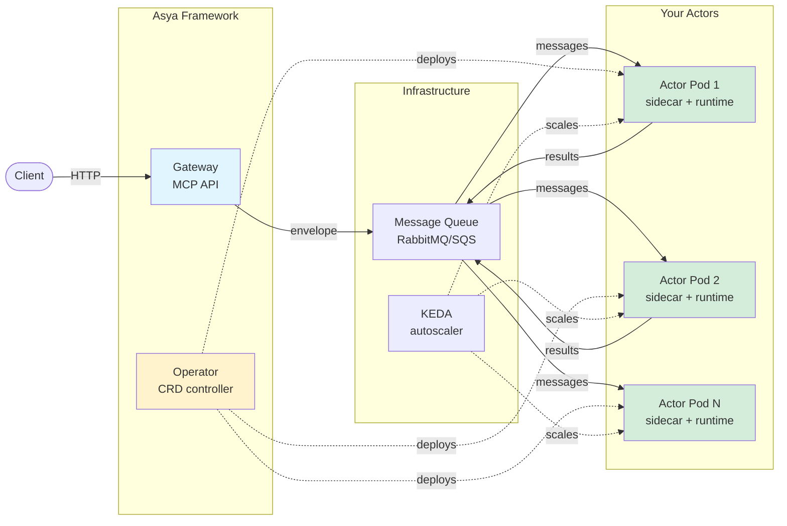

# Architecture Overview

Asya🎭 is a Kubernetes-native async actor framework with pluggable components for AI/ML orchestration.

## System Architecture

## Core Components

### Framework Components

- **[Operator](asya-operator.md)**: Kubernetes controller that watches AsyncActor CRDs, injects sidecars, configures KEDA autoscaling
- **[Gateway](asya-gateway.md)**: Optional MCP HTTP API for envelope submission, SSE streaming, and status tracking
- **[CLI](asya-cli.md)**: Command-line tool for interacting with the gateway (MCP client)

### Actor Components

Each actor pod contains two containers:

- **[Sidecar](asya-sidecar.md)**: Handles queue consumption, message routing, retries, progress reporting (Go)
- **[Runtime](asya-runtime.md)**: Executes your Python handler via Unix socket, handles OOM recovery

### System Actors

- **[Crew Actors](asya-crew.md)**: Special actors with reserved roles (`happy-end`, `error-end`) for result persistence and error handling

### Infrastructure

- **[Message Queue](transports/README.md)**: Pluggable transports (SQS, RabbitMQ, Kafka/NATS planned)
- **[KEDA](autoscaling.md)**: Monitors queue depth, scales actors 0→N based on workload
- **[Observability](observability.md)**: Prometheus metrics, structured logging, OpenTelemetry integration

## Message Flow

1. **Client** sends request to Gateway (or directly to queue)
2. **Gateway** creates envelope, routes to first actor's queue
3. **Sidecar** consumes message from queue
4. **Sidecar** forwards envelope to Runtime via Unix socket
5. **Runtime** executes your Python handler, returns result
6. **Sidecar** routes result to next actor's queue (or `happy-end`/`error-end`)
7. Repeat steps 3-6 for each actor in the route
8. **Crew actor** (`happy-end` or `error-end`) persists final result, reports status to gateway

**Key insight**: `Queue → Sidecar → Your Code → Sidecar → Next Queue`

## Actor Lifecycle

1. User creates AsyncActor CRD
2. Operator reconciles:
   - Creates queue (`asya-{actor_name}`)
   - Injects sidecar container
   - Injects runtime entrypoint
   - Creates KEDA ScaledObject (if scaling enabled)
3. KEDA monitors queue depth, scales pods 0→N
4. Sidecar consumes messages, routes to runtime
5. Runtime executes handler, returns results
6. Sidecar routes results to next queue

## Protocols

- **[Actor-to-Actor](protocols/actor-actor.md)**: Envelope structure, routing, status tracking
- **[Sidecar-Runtime](protocols/sidecar-runtime.md)**: Unix socket communication, framing protocol, error handling

## Component Details

- **[AsyncActor CRD](asya-actor.md)**: Workload specification, scaling configuration, timeout settings
- **[Autoscaling](autoscaling.md)**: KEDA integration, scaling strategies, queue-based autoscaling
- **[Observability](observability.md)**: Metrics, logging, tracing, monitoring best practices

## Deployment Patterns

**AWS (SQS + S3)**:

- Operator creates SQS queues
- Actors use IAM roles (IRSA/Pod Identity) for queue access
- Results stored in S3
- KEDA uses CloudWatch metrics

**Self-hosted (RabbitMQ + MinIO)**:

- Operator creates RabbitMQ queues via Management API
- Actors use username/password from secrets
- Results stored in MinIO (S3-compatible)
- KEDA uses RabbitMQ API

**See**: Installation Guides ([AWS EKS](../install/aws-eks.md), [Local Kind](../install/local-kind.md)) for detailed deployment instructions.
